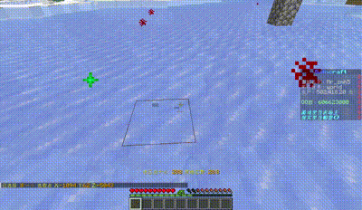

# TubeCraft 服务器领地

你还在害怕有人恶意从你的仓库里偷东西？

你还在担心你的基地被熊？

领地，就是上面问题的解决方案之一。

它一个必不可少的功能，你可以使用它干很多事情！

## PART 0 准备

木锄头用来创建领地。

线用来查询领地。

## PART 1 创建领地

1. 用木锄头**左键**点击一个方块来选择领地的**第一个**点
2. 用木锄头**右键**点击另一个方块来选择领地的**第二个**点
3. 打开聊天框，输入 `/res create <领地名称>`，看到创建成功即可

> [!note]
> 创建领地时需支付一定的 [TubeCoin](tubecraft/content/tubecoin)。 

## PART 2 删除领地

1. 打开聊天框，输入 `/res remove <领地名称>`
2. 然后输入 `/res confirm` 进一步确认删除领地

## PART 3 领地常用命令
| 指令 | 效果 | 备注 |
| --- | --- | --- |
| `/res tp <领地名称>` | 传送到某个领地 | 需领地所有者先设置权限，默认为不允许 |
| `/res set` | 设置你的领地 | 需站在属于你的领地上 |
| `/res padd <基础权限>` | 为一个玩家添加你的领地的基础权限 | - |
| `/res pset <单独设置权限>` | 同上 | - |
| `/res give <领地名称> <对方名称>` | 赠送你的领地到一个玩家 | - |
| `/res remove <领地名称>` | 删除你的领地 | 需再次确认 |
| `/res mirror <领地1> <领地2>` | 从一个领地复制权限到另一个领地 | - |
| `/res select sky` | 高到最高 | - |
| `/res select bedrock` | 低到最低 | - |
| `/res select chunk` | 选择整区块 | - |
| `/res select vert` | 到最大高度深度 | - |
| `/res select cost` | 显示选择领地的价格 | - |
| `/res tpset` | 在所站的地方设置领地默认传送点 | 防止传送卡在奇奇怪怪的地方 |
| `/res subzone <子领地名称>` | 创建子领域 | 子领地可单独设置 |
| `/res setmain` | 设置所站处为主领地 | |
| `/res message <领地名称> enter` | 设置进入领地消息 | - |
| `/res message <领地名称> leave` | 设置离开领地消息 | - |
